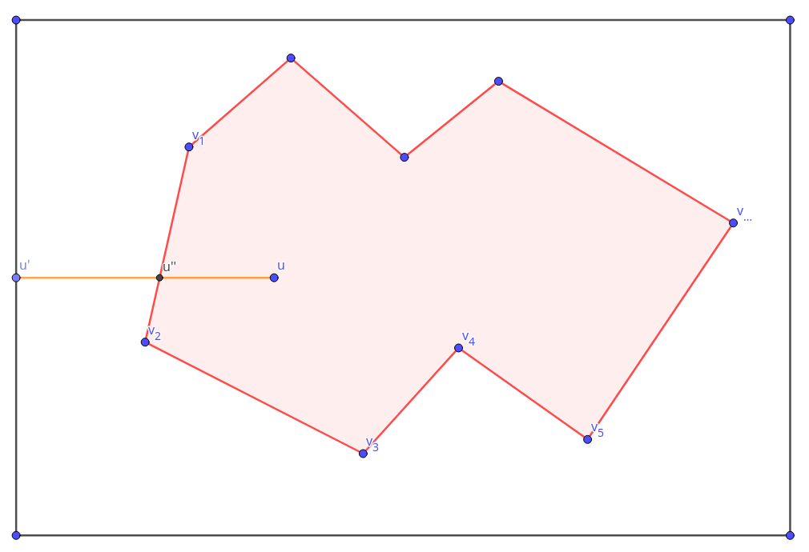

# Contour to mask function

The goal of this function is, given a contour, to create a mask.

To do so, we implement a parallelized version of the ray casting algorithm.
It determines wether a point is in a polygon or not.
The idea is to draw a line from the considered point to any point in the border of the image. If this line cross an odd number edges of the polygon, it is located outside, otherwise it is inside.

## Ray casting

We consider a polygon $P=(v^i)_{1\leq i \leq N}$ defined by its $N$ vertices, and the point $u$.

For each point $v$, $v_x$ references to its $x$ coordinate and $v_y$ to its $y$ coordinate.

$u'$ is the projection of $u$ on the $y$ axis so $u'=(0,u_y)$.

We want to exhibit constraints to check if the segment $[u,u']$ crosses the egdes of the polygon.

In the following we will only consider the edge $[v¹,v²]$.

### Conditions

A __first condition__ to ensure that $[u,u']$ crosses $[v¹,v²]$ should determine wether one point is above (considering the $y$ axis) and the other below the segment.

This is true if the following condition is satisfied :
$$(v¹_y-u_y)\times (v²_y-u_y)<0$$

That we write :
$$\underbrace{v¹_yv²_y}_a + {u_y}² - \underbrace{(v¹_y + v²_y)}_b.u_y < 0$$

The __second condition__ determines wether the intersection between $[v¹,v²]$ and the half-right $[u',u)$ denoted $u''$ is above $u$ (considering the $x$ axis) or not.

An equation of $(v¹,v²)$ right is given by :
$$p_x = \frac{1}{v¹_y-v²_y}.((v¹_x-v²_x).p_y+(v²_xv¹_y - v^1_xv²_y))$$

We know that $u$ and $u''$ have the same $y$ coordinate, then : $$u''_x = \frac{1}{v¹_y-v²_y}.((v¹_x-v²_x).u_y+(v²_xv¹_y - v^1_xv²_y))$$

And the condition $u''_x < u_x$ become :
$$\frac{1}{v¹_y-v²_y}.((v¹_x-v²_x).u_y+(v²_xv¹_y - v^1_xv²_y)) - u_x < 0$$

To prevent division by zero, we write it :
$$\underbrace{(v¹_x-v²_x)}_c.u_y - \underbrace{(v¹_y-v²_y)}_d.u_x +\underbrace{(v²_xv¹_y - v^1_xv²_y)}_e < 0$$

The equivalence is correct because before calculation we make sure that for any edge the first point considered ($v_1$), is the one with the higher $y$ coordinate. Then $(v¹_y-v²_y)$ is positive.

### Summary

For each edge we compute :
$$a=v¹_yv²_y$$
$$b=v¹_y + v²_y$$
$$c=v¹_x-v²_x$$
$$d=v¹_y-v²_y$$
$$e=v²_xv¹_y - v¹_xv²_y$$

Then check the two conditions :
$$a + {u_y}² - b.u_y < 0$$
$$c.u_y - d.u_x +e < 0$$

If they are both satisfied, the segment $[u,u']$ crosses $[v¹,v²]$.

## Point in polygon

When this process is done for every edge, we simply count the number of edges intersected for every point in the image and conclude.

## Pytorch in practice

We speed up the process and compute efficiently this point in polygon process for every point in the image and then create a mask, we used the following way.

We store $V¹\in \mathcal{M}(N,2)$ with row $k$ being the point $v¹ = (v¹_x,v¹_y)$ of the edge $k$.
Similarly $V²$ is the second point of each edge.

Then compute :

$$A=V¹_yV²_y$$
$$B=V¹_y + V²_y$$
$$C=V¹_x-V²_x$$
$$D=V¹_y-V²_y$$
$$E=V²_xV¹_y - V¹_xV²_y$$

That are vector storing the values of $a,b,c,d$ and $e$ for each edge.

We also compute :
$X\in\mathcal{M}(H,W)$ (respectively $Y\in\mathcal{M}(H,W)$)  storing the value of $x$ (respectively $y$) for each point of the image : $X_{i,j}=j$ ($Y_{i,j}=i$).

Then we compute the :

$$C_1 = (A + Y² - B.Y < 0)$$
$$C_2 = (C.Y - D.X + E < 0)$$

That are two boolean, broadcasted matrix of dimension $(H,W,N)$ such that ${C_1}_{i,j,k}=1$ if and only if the condition one is respected for the edge $k$ with the point $u=(j,i)$.

Finally the matrix $C_1.C_2$ (element-wise product) give for each point and each edge if the line from this point to the $y$ axis crosses the considered edge.

The final mask is given by :
$$mask = (((torch.sum(C_1.C_2,axis=2) \% 2 ) == 1)$$
