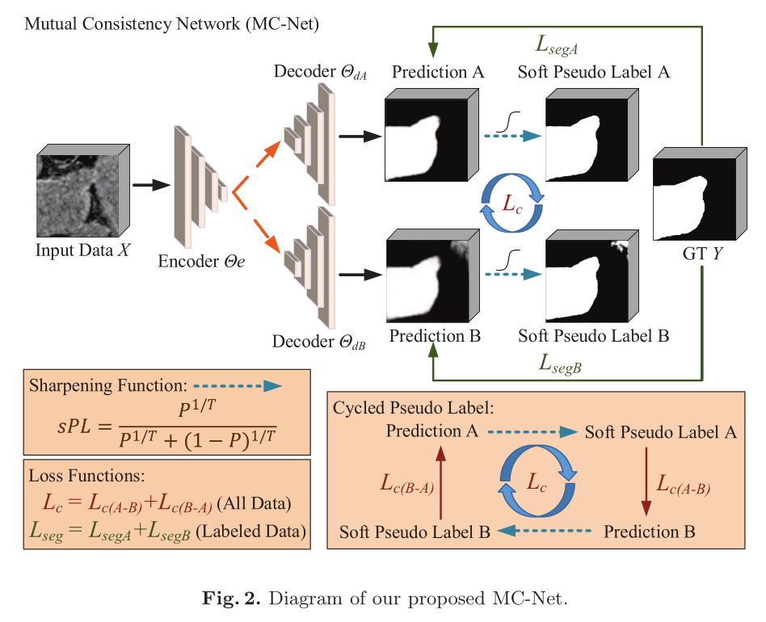
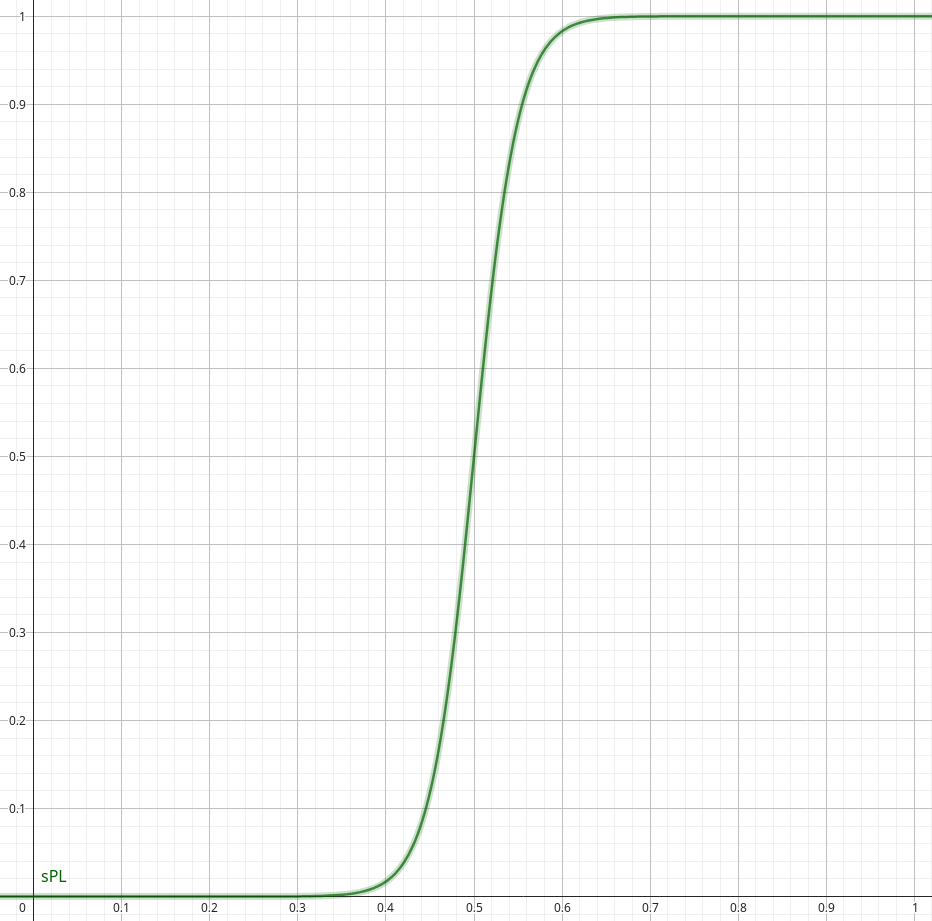
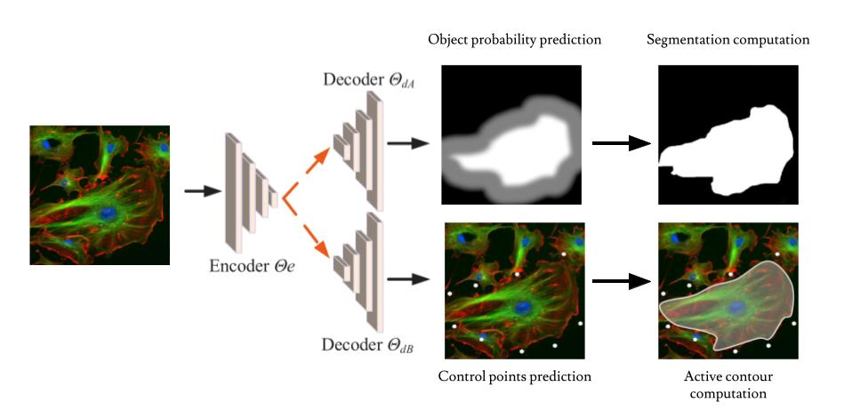

# Y-NET : semi supervised learning using two decoder based on different architectures learning from each other

## Orignial paper : MC-net principle

Idea inspired from **"Semi-supervised left atrium segmentation with mutual consistency training"** - *Yicheng Wu*

### General Idea

The general idea of the method is to train an encoder and two decoder. The two decoder have different architectures. They are fed using the same input coming from the encoder.
The two segmentation given by each of them are compared to improve the performance especially where the uncertainty is high : the two decoders will learn from each other.

### Notations

- Input : $X$
- Output of the encoder : $F_e = f_{\theta_e}(X)$
- Output of the decoder A : $F_A = f_{\theta_{dA}}(F_e)$
- Output of the decoder B : $F_B = f_{\theta_{dB}}(F_e)$
- Sigmoid function : $\sigma : \mathbb{R} \rightarrow [0,1] ; x \rightarrow \frac{1}{1+e^{-x}}$
- Probability map (segmentation) from A : $P_A = \sigma(F_A)$
- Probability map (segmentation) from B : $P_B = \sigma(F_B)$

### Sharpening function

Transform the proba in "soft pseudo labels"

$sPL = \frac{P^{1/T}}{P^{1/T}+(1-P)^{1/T}}$

In the article $T=0.1$

Almost all values in $[0,1]$ are mapped on $\{0,1\}$ to create pseudo labels.

### Loss function

The final loss function is composed of two terms. A first one for the classical learning of the algorithms, comparing predicted probabilities to ground truth labels. A second one comparing the probability of an encoder with the pseudo labels of the other.

$loss = \underbrace{Dice(P_A,Y) + Dice(P_B,Y)}_{L_{seg}} + \lambda\times \underbrace{(L_2(P_A,sPL_B) + L_2(P_B, sPL_A))}_{L_{c}}$

with $L_2$ an mean squared error loss.

### Semi supervised approach

The approach is called semi supervised because it uses two kinds of data :

- **labelled** data for which both part of the loss are used ($L_{seg}$ and $L_c$)
- **unlabelled** data for which only the second part of the loss is used ($L_c$)

This method allows to take profit of unlabelled data and drastically increase the amount of images available for training.

-------------------

## Deep learning and activ contours hybrid method inspired by MC-net

The idea is to developp a similar pipeline dedicated to our usecase.

### Data

The goal is to applied the method developped to 3D volumes of cells. But to test the efficiency of the process we will most probably apply it on 2D images in a first time.

Severall dataset of 2D images are available on the net such as the [Kaggle Data science bowl 2018](https://www.kaggle.com/c/data-science-bowl-2018). All the dataset is labelled but the method could still be applied using some images without their labels (it could be a good way to understand the influence of unlabelled images on the efficiency of the training).

In the following, we will consider an image $X$ of size $(W\times H)$, and its corresponding segmentation mask $Y$

Concerning 3D datasets, it is harder to find a good amount of labelled real 3D images and that is why this method could be of great interest. Some synthetic datasets exist such as the ones available on [Cell Tracking Challenge](http://celltrackingchallenge.net/3d-datasets/). The goal is to test the method on such datasets in a second time.

### Decoders

The idea is to reproduce the same architecture than the one descibed in the paper : one encoder linked to two decoders. But in our case, we want to introduce the activ contours representation of a cell in our pipeline. To do so, one decoder will use the classical approach and predict a probability map for the segmentation. But the second decoder will have a very different role : predicting the positions of the control points of a snake segmenting the object of interest.

The output of the decoder $A$ is a probability map $P_A = (p_A^{i,j})_{\substack{0\leq i<W\\0\leq j<H}}\in[0,1]^{W\times H}$ giving for each pixel $(i,j)$ the probability to belong of the object of interest.

It can easily be transformed into a pseudo segmentation mask using a threshold : $S_A = P_A>0.5$.

The output of the decoder $B$ is really different. It is a vector $\bm{u}=(u_i)_{0\leq i <2M}$ of size $2M$ where $M$ is the number of control points of the parametric curve that we want to define.

The parametric curve is then defined by $\forall t\in [0,1],~s(t) = \sum_{k=1}^M \bm{c_k} \phi(tM-k)$ where $\forall k \in \{1,...,M\},~\bm{c_k}=(u_{2(k-1)}, u_{2k-1})$ are the control points and $\phi$ is the basis function used.

(The 2D case is here depicted but is very similar to 3D one, the only difference is the dimension of control points and the construction of the basis function).

### Simultaneous training of the two models

Has mentionned in the initial article, the objective is to train the two model simultaneously. The following part is dedicated to describe the formalisation of the different parts of the loss and the inter training method.

#### Training the object probability part

The common way to train such kind of network is to compare the segmentation mask provided with the image with the object probability provided by the network. To do so, the Dice loss is generally used.

To use the segmentation provided by the active contours network and increase the consistency of the two parts, it is necessary to transform the contour given by the $B$ decoder into a segementation mask.

To do so : ## TODO ## (pas encore trouvé comment efficacement créer le mask de segmentation à partir du contour)

#### Training the control points prediction part

Some papers introduce a way to train a network that predicts snake control points position. In **A Learning-Based Formulation of Parametric Curve Fitting for Bioimage Analysis** - *Soham Mandal and Virginie Uhlmann* a loss is introduce.

Like in the $A$ decoder training, the segmentation ground truth is generally a segmentation mask. It is necessary to extract from this segmentation, something comparable to our contour.

In a first time, it is necessary to extract the contour from the segmentation mask. The method used in the article is depicted in **Topological Structural Analysis of Digitized Binary Images by Border Following** - *Satochi Suzuki and Keiichi Abe*.

A most understandable algorithm (according to me) is depicted on the Wiki page of the [Moore Neighborhood algorithm](https://en.wikipedia.org/wiki/Moore_neighborhood#Algorithm).

A brief summary of the main idea is : scanning the image until you find a pixel $s$ set to 1 (or the label associated to the object of interest), it is our starting point. The pixel visited just a step before $b$ is also stored, and we fix $p=s$. Then iteratively find the first pixel $c$ with label 1 in the neighborhood of $p$ when you browse it in clockwise direction starting from $b$. Add $c$ to contour $C$. Then update $b=p$, $p=c$. Stop when you come back on $s$.

Doing this creates a contour ordered in clockwise direction composed of $P$ pixels $(\bm{a}_i)_{0\leq i \leq P-1}\in{([|0,W-1|]\times[|0,H-1|])}^P$.

We sample our active contour to get $P$ points on it $(\bm{b}_i)_{0\leq i \leq P-1} = (\bm{s}(\frac{i}{P}))_{0 \leq i \leq P-1}$.

We now have two set of points that are comparable using a classical distance :

$L_{snake}(\bm{a},\bm{b}) = \min_{j\in{\{0,...,P-1\}}} \sum_{i=1}^P ||a_i-b_{(i+j)\textrm{mod}P}||$

The min over $j$ is used because the two contours don't necessarily start from the same point originally.

Using this method, one can easily train a snake control points model using either the ground truth segmentation mask or the mask computed using the decoder $A$ output.

### Loss

Our final loss will be :

$Loss = \gamma \times \underbrace{L_{proda}(P_A,Y) + L_{snake}(c_{GT},b_{GT})}_{L_{seg}} + (1-\gamma) \times (\underbrace{L_{proba}(P_A,Y_B) + L_{snake}(a_{pred},b_{pred})}_{L_{consistency}})$

where :

- $P_A = \sigma(f_{\theta_A}(X))$ is the probability map given by decoder A
- $c_{GT} = (c_i)_{0\leq i \leq P_{GT}-1}$ is the contour extracted from $Y$ using the "Moore neighborhood algorithm"
- $b_{GT} = (b_i)_{0\leq i \leq P_{GT}-1}$ is the sampling of the active contour predicted by $B$ to get $P_{GT}$ points ($s(\frac{i}{P_{GT}})_{0\leq i \leq P_{GT}-1}$).
- $Y_B$ is the segmentation mask computed using the segmentation given by the snake predicted by $B$.
- $a_{pred} = (a_i)_{0\leq i \leq P_{pred}-1}$ is the contour extracted from the mask $(P_A>0.5)$ using the "Moore neighborhood algorithm".
- $b_{pred} = (b_i)_{0\leq i \leq P_{pred}-1}$ is the sampling of the active contour predicted by $B$ to get $P_{pred}$ points ($s(\frac{i}{P_{pred}})_{0\leq i \leq P_{pred}-1}$).

### Supposed advantages of the method

No holes and a better regularity for the full deep learning model as it is trained using snake predictions.

A larger database to train the snake model using the unsupervised part of the loss.
